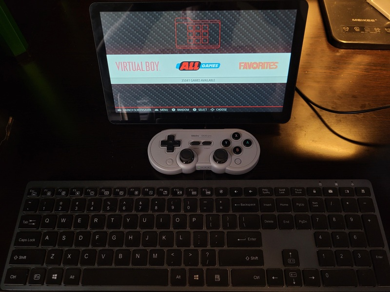
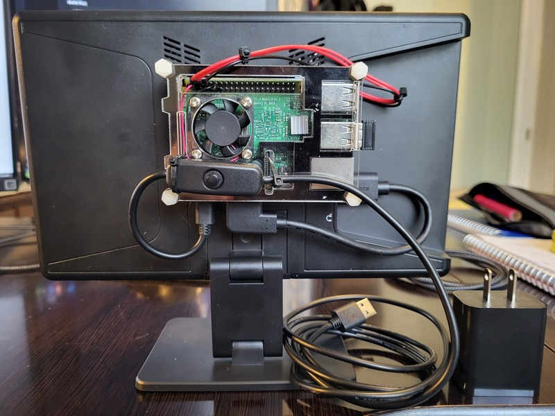

# Portable RetroPie Config Files

Here I place my working config files for my RetroPie.

My RetroPie is a work in progress with many parts I already had sitting around.
I will share details of this easy build here.

## Features:

- 10 inch HDMI LCD screen.
- Raspberry Pi 3B+ running the Buster release of Retropie.
- Wireless controllers and keyboard.
- Fully portable: needs only a USB-A power connection.

## Components:

- 1x RPi 3B+ (v1.2) with the latest RetroPie image.
- 1x RPi 3B+ Case (Choose One you like).
- 1x [HD 10.1" TouchScreen](https://www.amazon.com/dp/B0CJNKFVPY?th=1)
    - This kit comes with a new power supply and a bunch of cables for the power and touchscreen.
    - This screen can be powered directly by the RPi 5V & Ground GPIO, thereby only needing
- 1x [Wireless Keyboard](https://www.amazon.com/dp/B098WTHSYR)

## Build Pics:

- Note that this is a work in progress. When I get a 3D printer, I would like to create a better stand/case with a handle for easy travel.

Front View:

  

Rear View

